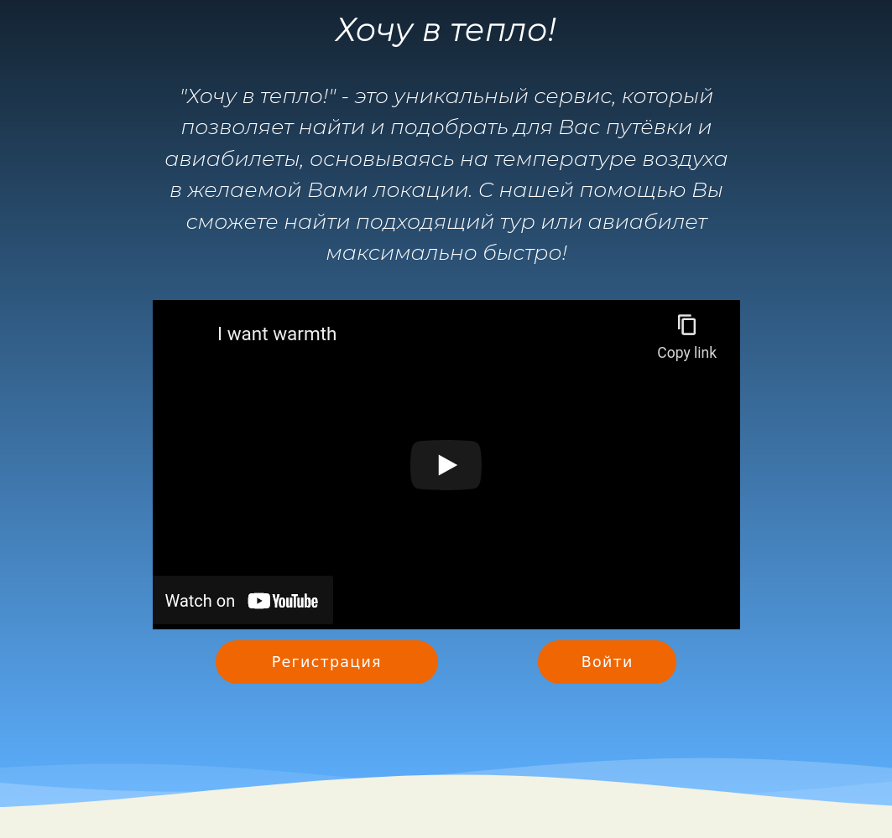
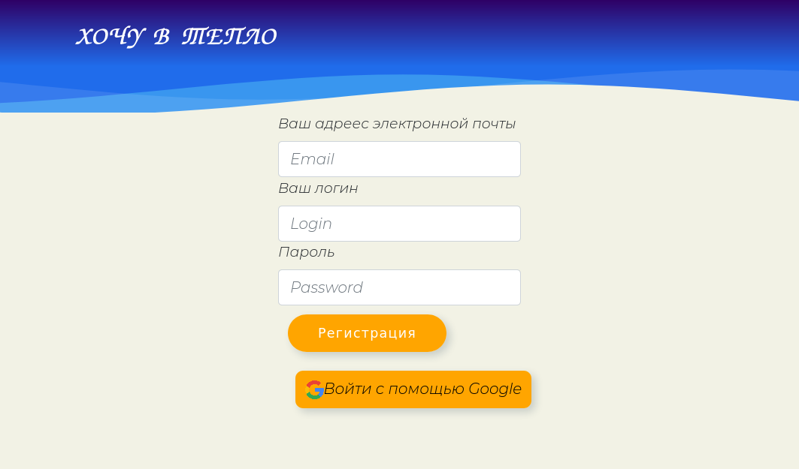
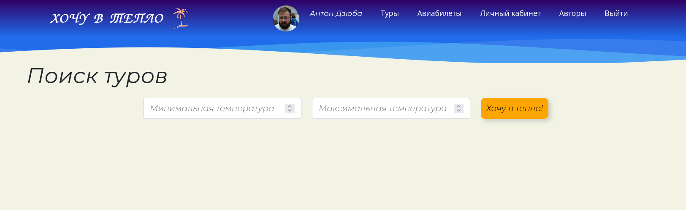
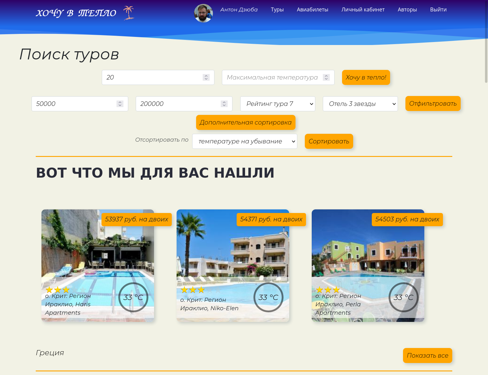
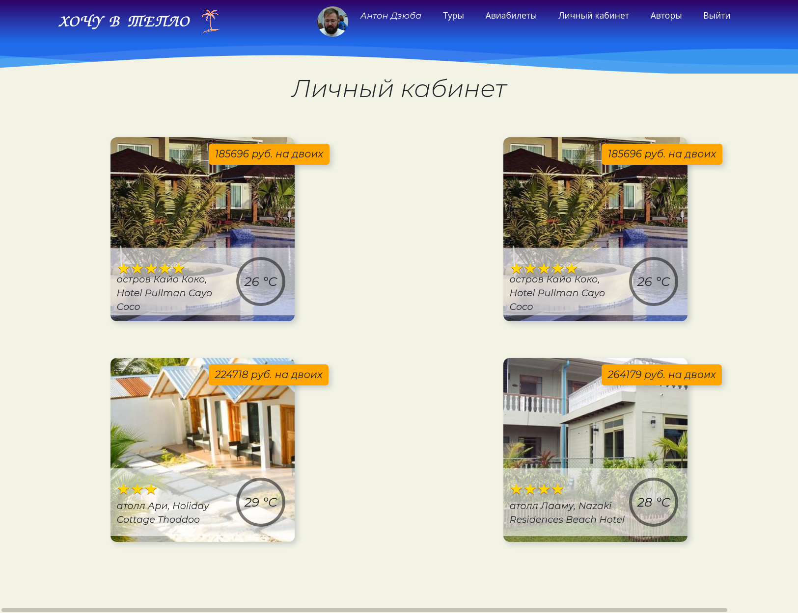

# Хочу в тепло!

  
"Хочу в тепло!" - это уникальный сервис, который позволяет найти и подобрать для Вас путёвки и авиабилеты, основываясь на температуре воздуха в желаемой Вами локации. С нашей помощью Вы сможете найти подходящий тур или авиабилет максимально быстро!
  

<a href="https://www.youtube.com/embed/jzqCPPcDv8A" target="_blank">

    
    <h3><a href="https://www.youtube.com/embed/jzqCPPcDv8A" target="_blank">Intro-video - Хочу в тепло! | Youtube</a></h3>
  

</a>

Если вам очень хочется в тепло просто зайдите на <a href="https://teplo.herokuapp.com/" >https://teplo.herokuapp.com/</a>! Приложение подберёт для вас в первую очередь самые выгодные туры и авиабилеты.

<ul>
<li>Заходим на <a href="https://todos-and-notes.herokuapp.com">сайт<a/></li>

  
<li>Регистрируемся или входим через Google аккаунт</li>

  
<li>Вводим желаемый диапазон температуры или сразу все предложения, что найдем по умолчанию от 0 до самых теплых мест. Доступна дополнительная фильтрация и сортировка для удобного поиска. Аналогично можем выбрать и авиабилеты.</li>

  
<li>Что бы сохранить выбраный тур или авиабилет просто кликнем по звездочке. В личном кабинете мы сможем найти всё что мы сохранили. А если что то захотим удалить из нашей подборки то снова кликнем на звездочку.</li>

</ul>
  

# Техгологии в проекте

  
Back-end:
Nodejs, Expressjs, Mongoose, MongoDB Atlas, Google oauth2.0, Cors, .env
  
На сервере запущен Node Schedule скрипт, который раз в сутки запускает сбор информации с помощью библеотеки Puppeteer и записывает в базу данных. В процессе сбора, скрипт обращается к Yandex Geocode Maps API и Openweathermap API. Так же доступен телеграм бот.
  

  
  
  
  

  
Front-end:
React, Redux, Redux Thunk, Redux devtools, CSS
  
Верстка выполнена с помощью библеотеки Bootstrap.
  

  

